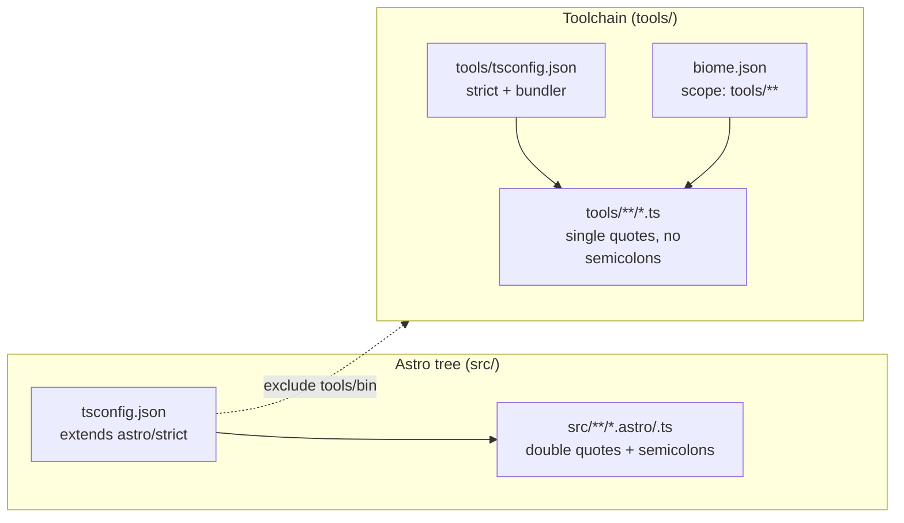

# 001 — TypeScript toolchain & layout — PLAN (delta)

**Status:** plan **Owner:** AI (from Konstantin's spec) **Depends on:** — **Blocks:** 002, 003, 004, 005

> ⚠️ **This plan is a DELTA, not a rewrite.** The spec for 001 was written
> *before* PRs #2 (002 genkit engine) and #3 (003 dotprompt library) landed.
> Building those slices already dragged most of 001's structural requirements
> into `main` as a side effect: the `tools/` layout exists, there is a scoped
> `tools/tsconfig.json`, every file is `.ts`, `scripts/` is gone, and a
> `bun test` + CI pipeline runs. So this plan **inventories what already
> shipped** and then plans **only the remaining gaps**: `commander` + a stub
> CLI, **Biome** lint/format, optional `tools/lib/`, the docs/justfile updates,
> and closing the spec's open questions.

______________________________________________________________________

## 1. Overview / approach

The foundation the spec asked for is ~70% in place. The job now is to finish
the *tooling* half (CLI wiring + lint/format) without disturbing the
*structural* half that's already merged, and without churning either the
toolchain or the Astro tree.

Three guiding constraints, all verified against the live repo:

1. **Match the existing `.ts` style exactly.** Every file under `tools/` is
   **2-space indent, single quotes, no semicolons, trailing commas in
   multiline literals**, and wraps around ~80 cols (verified in
   `tools/ai/providers.ts`, `tools/digest/index.ts`). Biome's config must
   encode exactly this so `biome check` is clean on the *current* tree with
   zero reformatting churn.

1. **Biome must not fight Astro.** The repo's Astro side uses the *opposite*
   style — **double quotes + semicolons** (see `astro.config.mjs`, which is
   `// @ts-check` double-quoted). Biome therefore must be **scoped to `tools/`
   (plus its own config and `package.json`) and explicitly ignore `src/`,
   `dist/`, `.astro/`, `public/`, and `*.astro`/`*.mjs`.** Biome's Astro/Svelte
   support is partial anyway; keeping it off the framework tree is both safer
   and matches the spec ("personal blog, keep it light").

1. **The CLI stub is wiring-only.** 004 owns the real flag surface. Here we add
   `commander` as a dependency and a `--help`/`--version`-only entry point so
   that (a) the dependency is locked in `bun.lock` for 004 to build on, and
   (b) `tsc` and Biome exercise a real commander import. No behaviour change to
   `bun run digest`.

Net new developer-facing surface after this chunk:
`bun run lint`, `bun run lint:fix`, `bun run format`, `bun run check`, and a
runnable `bun tools/cli.ts --help`.

______________________________________________________________________

## 2. Already done vs remaining (delta table)

| Spec requirement | Status | Evidence / notes |
| --- | --- | --- |
| `tools/` at repo root, Astro keeps `src/` | ✅ DONE | `tools/{ai,digest}/…` present; `src/` untouched |
| `scripts/` retired (`ai-digest`, `tools.mjs`) | ✅ DONE | only `scripts/migration-report.json` remains — a build artifact, **delete it** (see §4) |
| Scoped `tools/tsconfig.json`, strict, bun+ESM | ✅ DONE | `strict`, `verbatimModuleSyntax`, `moduleResolution: bundler`, `noEmit`, `types:[node,bun]`, `noUncheckedIndexedAccess` |
| `bun run typecheck` (`tsc --noEmit`) passes | ✅ DONE | `package.json` `"typecheck": "tsc -p tools/tsconfig.json"` |
| Runtime bun + ESM + `.ts`; no new `.mjs` | ✅ DONE (toolchain) | all of `tools/` is `.ts`; `bin/convert.mjs` is the only `.mjs` (allowed, see Q2) |
| `bun run digest` still works | ✅ DONE | `"digest": "bun tools/digest/index.ts"` |
| Test runner | ✅ DONE (beyond spec) | spec called this a non-goal, but 002/003 added `bun test`; CI runs it. We keep it. |
| CI: install → typecheck → test → build | ✅ DONE | `.github/workflows/ci.yml` |
| **`commander` dependency + stub CLI** | ❌ TODO | this chunk — §4 |
| **Biome: config + lint/format/check scripts** | ❌ TODO | this chunk — §4, §5 |
| **Biome step in CI** | ❌ TODO | this chunk — §5 |
| **`tools/lib/` for shared helpers** | �🟡 OPTIONAL | introduce minimally; see §3 / §4 |
| **justfile: `lint`/`format`/`check` recipes** | ❌ TODO | this chunk — §4 |
| **`CLAUDE.md` Commands + Layout updates** | ❌ TODO | this chunk — §4 |
| Resolve open questions (Biome? convert.mjs? tsconfig refs?) | ❌ TODO | §7 |

______________________________________________________________________

## 3. Architecture & key decisions

### D1 — Lint/format tool: **Biome** (confirm the spec's lean)

Single fast binary, lint + format in one config, first-class TS/bun story, no
plugin zoo. ESLint+Prettier would mean two configs, two passes, and a
flat-config migration for a one-person blog. **Decision: Biome.** Closes
open-question Q1.

### D2 — Biome scope: **`tools/` only**

Biome's formatter would rewrite `src/**/*.ts`/`astro.config.mjs` from
double-quote+semicolon to single-quote+no-semicolon, producing a huge,
pointless diff and risking Astro/Vite config breakage. We pin Biome to the
toolchain via an explicit `files.includes` allowlist (or top-level `includes`
in Biome ≥ 2.x) covering `tools/**`, `biome.json`, and `package.json`, and rely
on Biome's default ignores plus explicit negations for `dist`, `.astro`,
`node_modules`, `public`, `src`, and `*.astro`/`*.mjs`. Net result: `src/`
stays Astro's territory, `tools/` stays Biome's.

### D3 — Formatter settings: **mirror the existing tree** (zero churn)

From reading the live `.ts` files: `indentStyle: "space"`, `indentWidth: 2`,
`quoteStyle: "single"`, `semicolons: "asNeeded"`, `trailingCommas: "all"`,
`lineWidth: 80`. JSON files (`tsconfig.json`, `biome.json`) keep 2-space.
This must be validated by running `biome check tools/` and confirming **zero
files would be reformatted** (§6). If any churn appears, adjust the config to
match the code — never reformat the merged tree in this chunk.

### D4 — Linter ruleset: **`recommended`, lightly trimmed**

Enable Biome's `recommended` rules. The genkit code uses
`process.env`, `console.log`, and a couple of `as` casts on Genkit's loosely
typed `.output`; rather than rewrite working code, **disable only the rules
that would flag existing intentional patterns** (candidates, to be confirmed
empirically by a first `biome lint` run): `suspicious/noConsole` (the digest is
a CLI; logging is the point), and keep `noExplicitAny`/`noNonNullAssertion` at
their recommended levels unless they fire on existing code — if they do, prefer
a narrowly-scoped `// biome-ignore` with a reason over globally disabling. Keep
the off-list short; document each disable inline in `biome.json`.

### D5 — CLI stub location: **`tools/cli.ts`** (single shared entry)

The spec sketched `tools/digest/cli.ts`. I place the stub one level up at
**`tools/cli.ts`** instead, because 004's commander program is the *toolchain*
entry (it will host `digest`, `article`, `news`, `--compile-sources`
subcommands), not a digest-internal detail. Keeping it at `tools/cli.ts`
mirrors the eventual `bun run cli` script and avoids a later move. The existing
`tools/digest/index.ts` stays exactly as-is (still `bun run digest`); the stub
does **not** wire into it yet — that's 004.

### D6 — `tools/lib/`: **defer, with one tiny seed (optional)**

The spec proposes `tools/lib/{env,fs,date,http}`. Today nothing shared exists
that isn't already co-located (e.g. date formatting lives inline in
`digest/index.ts`; provider/env resolution lives in `ai/genkit.ts`). Creating
four empty helper modules now is gold-plating (a non-goal). **Decision:** do
**not** pre-build `tools/lib/`. If we want a non-empty proof-of-structure,
seed a single `tools/lib/env.ts` exporting a typed `requireEnv(name)` /
`readEnv(name, fallback)` helper that 004's CLI and the genkit resolver can
later adopt — but only if it ships with a colocated test. Mark this **optional**
in §4; the chunk is acceptance-complete without it. This keeps faith with the
spec's "don't gold-plate" non-goal while leaving the door open.

### D7 — tsconfig topology: **keep standalone `tools/tsconfig.json`**

Closes open-question Q3. The standalone scoped config already works and
`typecheck` is green. Project `references` would add ceremony for zero benefit
at this size. **However**, note the latent issue in D8 — the *root* tsconfig
over-includes — and decide whether to fix it here.

### D8 — Root `tsconfig.json` over-inclusion (decision: **fix, low-risk**)

`tsconfig.json` (Astro's, `extends astro/tsconfigs/strict`) sets
`"include": ["**/*"]`, so the editor/Astro language server also type-checks
`tools/**` under *Astro's* strict config — a second, different ruleset than
`tools/tsconfig.json`. This is invisible to CI (CI runs `tsc -p
tools/tsconfig.json` only) but pollutes editor diagnostics and conceptually
breaks the spec's "the two must not fight" requirement. **Decision:** add
`"tools"` (and `"bin"`) to the root tsconfig's `exclude` so Astro's config owns
`src/` and the toolchain config owns `tools/` cleanly. Verify `astro build`
and `astro check` (if used) are unaffected. If excluding `tools` somehow
perturbs Astro's resolution, fall back to leaving it and noting the
double-check as a known, harmless quirk — but the exclude is the clean fix and
is preferred.



______________________________________________________________________

## 4. File-by-file task list

### CREATE — `biome.json`

Biome config at repo root (Biome auto-discovers it), **scoped to `tools/`**.
Target the Biome major version that resolves from `@biomejs/biome` at install
time (Biome 2.x as of mid-2026); confirm schema URL/key names against the
installed version before committing (the `includes`/`files.includes` and
`assist` keys moved between 1.x and 2.x). Intended shape:

```jsonc
{
  "$schema": "https://biomejs.dev/schemas/<installed-version>/schema.json",
  "vcs": { "enabled": true, "clientKind": "git", "useIgnoreFile": true },
  "files": {
    // allowlist the toolchain; everything else is Astro's / build output
    "includes": [
      "tools/**/*.ts",
      "tools/**/*.json",
      "biome.json",
      "package.json",
      "!**/dist",
      "!**/node_modules",
      "!**/.astro",
      "!**/public",
      "!src/**",
      "!**/*.astro",
      "!bin/**"            // bin/convert.mjs is intentionally legacy .mjs
    ]
  },
  "formatter": {
    "enabled": true,
    "indentStyle": "space",
    "indentWidth": 2,
    "lineWidth": 80
  },
  "javascript": {
    "formatter": {
      "quoteStyle": "single",
      "semicolons": "asNeeded",
      "trailingCommas": "all"
    }
  },
  "linter": {
    "enabled": true,
    "rules": {
      "recommended": true
      // add narrowly-scoped disables ONLY for rules that fire on existing
      // intentional patterns (e.g. console logging in the CLI). Decide
      // empirically from the first `biome lint tools/` run; document inline.
    }
  }
}
```

Acceptance for this file: `biome check tools/` reports **0 files changed / 0
errors** against the *current* merged tree (D3). Tune settings to the code, not
the code to the settings.

### CREATE — `tools/cli.ts`

Minimal commander entry that proves wiring (D5). `--help` and `--version` only;
subcommands are 004. Match house style (single quotes, no semicolons, 2-space):

```ts
#!/usr/bin/env bun
/**
 * kig.re toolchain CLI (skeleton).
 *
 * Wiring-only entry point: it locks `commander` into the dependency tree and
 * proves the binary builds + typechecks. The real command surface
 * (`digest`, `article`, `news`, `--compile-sources`, depth/provider flags)
 * lands in .plans/004. `bun run digest` continues to call
 * tools/digest/index.ts directly until then.
 */
import { Command } from 'commander'

const program = new Command()

program
  .name('kigre')
  .description('kig.re content + AI toolchain')
  .version('1.0.0')

// Subcommands are added in .plans/004 (digest-cli-and-content-modes).

program.parseAsync(process.argv).catch((err) => {
  console.error(err)
  process.exit(1)
})
```

Add a colocated smoke test `tools/cli.test.ts` (the repo now has `bun test`):
spawn `bun tools/cli.ts --help` (or `--version`) and assert exit code 0 and
that output contains `kigre`. This keeps the new code under the project's
"every file has a test" norm and guards the wiring in CI.

### CREATE (optional, D6) — `tools/lib/env.ts` + `tools/lib/env.test.ts`

Only if we want a non-empty `tools/lib/`. A typed `requireEnv`/`readEnv` pair
with a small test. Skip otherwise; the chunk is complete without it.

### MODIFY — `package.json`

Add dependency + devDependency + scripts:

- `dependencies`: `"commander": "^14.0.0"` (confirm latest major at install).
- `devDependencies`: `"@biomejs/biome": "^2.0.0"` (pin to installed).
- `scripts`:
  - `"lint": "biome lint tools/"`
  - `"lint:fix": "biome lint --write tools/"`
  - `"format": "biome format --write tools/"`
  - `"check": "biome check tools/"`  (lint + format + import-organize, no write)
  - `"cli": "bun tools/cli.ts"`  (convenience; optional)

Leave `dev/build/preview/convert/digest/typecheck/test` untouched.

### MODIFY — `justfile`

Add recipes mirroring the scripts (the existing recipes already shell out to
`bun run …`, so stay consistent):

```just
# Lint the tools/ TypeScript toolchain (Biome)
lint:
    @bun run lint

# Format the tools/ TypeScript toolchain (Biome, in place)
format:
    @bun run format

# Lint + format check (no writes) — the CI gate
check:
    @bun run check
```

Keep the existing `# © 2026` header, `set shell`, and `set dotenv-load`.

### MODIFY — `.github/workflows/ci.yml`

Add a Biome step **after typecheck, before tests** (fail fast on style before
the slower test/build). Use the project's own pinned Biome (no extra action),
so the CI version always matches local:

```yaml
      - name: Lint + format check (tools/, Biome)
        run: bun run check
```

`bun install --frozen-lockfile` already installs `@biomejs/biome`, so no setup
step is needed. Keep the existing typecheck/test/build steps as-is.

### MODIFY — `CLAUDE.md`

- **Commands** block: add `bun run lint`, `bun run format`, `bun run check`
  (Biome over `tools/` only), and note the `tools/cli.ts` skeleton. Replace the
  line "There is no test suite and no linter configured" — both now exist
  (`bun test tools/`, Biome). State explicitly that **Biome is scoped to
  `tools/`; `src/` keeps Astro's double-quote/semicolon style** so contributors
  don't run Biome over the whole tree.
- **Layout of the source** section: add a `tools/` subsection describing
  `tools/ai/` (engine/providers/prompt-tools), `tools/digest/` (pipeline +
  arxiv), `tools/cli.ts` (CLI skeleton, full surface in 004),
  `tools/tsconfig.json` (scoped strict config), and `prompts/*.prompt`.
  Note `bin/convert.mjs` is intentionally legacy `.mjs`.

### DELETE — `scripts/migration-report.json`

Leftover one-shot artifact from the Jekyll migration; `scripts/` is supposed to
be retired. Remove it so the directory is gone entirely. (If `bin/convert.mjs`
or anything else reads it, leave it and note why — quick `rg migration-report`
check first.)

### NO CHANGE (decisions, not edits)

- `bin/convert.mjs` — **stays put, stays `.mjs`** (Q2). One-shot, already run,
  out of Biome/tsc scope.
- `tools/tsconfig.json` — already correct; standalone, no `references` (Q3/D7).
- `tools/digest/index.ts`, `tools/ai/*` — untouched (no behaviour change; this
  chunk is structure + tooling only, per the spec's non-goals).

______________________________________________________________________

## 5. Biome config specifics + CI integration

- **Discovery & scope.** Biome auto-loads `biome.json` from the repo root; the
  `files.includes` allowlist (D2) is what keeps it off `src/`. Always invoke as
  `biome … tools/` in scripts as a belt-and-suspenders second layer of scoping.
- **Version pinning.** Pin `@biomejs/biome` in `devDependencies`; CI uses the
  same version via `--frozen-lockfile`. Set the `$schema` URL to that exact
  version. **Verify config key names against the installed Biome major**
  (1.x → 2.x renamed/relocated several keys: top-level `files.includes`,
  `assist`, the `includes` negation syntax). Run `bun run check` locally once
  before committing to catch schema mismatches.
- **Style parity.** `quoteStyle: single`, `semicolons: asNeeded`,
  `trailingCommas: all`, `indentWidth: 2`, `lineWidth: 80` — chosen to reproduce
  the existing tree byte-for-byte (D3).
- **Ruleset.** `recommended: true`; trim only what fires on existing
  intentional code, documented inline (D4).
- **CI.** One new step, `bun run check`, after typecheck. No new action, no new
  install. Order: install → typecheck → **check** → test → build.

______________________________________________________________________

## 6. Test / verification plan

Run on a clean checkout of the feature branch (`bun install`):

1. **Zero-churn format check (the critical one).** `bun run check` →
   exit 0, **no files reported as needing changes**. If any file would be
   reformatted, the Biome config is wrong (D3) — fix the config, not the code.
1. **Lint clean.** `bun run lint` → exit 0 (after the empirically-determined,
   documented disables/ignores from D4).
1. **`--write` is a no-op.** `bun run format` then `git diff --stat` → empty.
   Proves the formatter agrees with the merged tree.
1. **Typecheck still green.** `bun run typecheck` → exit 0 (commander types
   resolve; `tools/cli.ts` compiles under strict + `verbatimModuleSyntax`).
1. **CLI stub runs.** `bun tools/cli.ts --help` → exit 0, prints usage with
   `kigre`; `bun tools/cli.ts --version` → `1.0.0`.
1. **Tests pass.** `bun run test` → green, including the new `tools/cli.test.ts`
   (and `tools/lib/env.test.ts` if D6 is taken).
1. **Astro untouched.** `bun run build` → succeeds; `git diff` shows no changes
   under `src/`; Biome never touched the Astro tree. If D8 applied, confirm the
   root-tsconfig `exclude` didn't perturb `astro build`.
1. **`digest` unaffected.** `package.json` `digest` script unchanged; smoke that
   `bun tools/digest/index.ts` still starts and resolves a provider (it will
   exit on missing key — that's fine; we only verify wiring, not a live call,
   since no provider key is available in this env).
1. **CI dry-run mentally mapped:** the new `check` step runs between typecheck
   and test; `--frozen-lockfile` installs Biome + commander; lockfile updated.

______________________________________________________________________

## 7. Risks & open questions

**Resolved open questions (from the spec):**

- **Q1 Biome vs ESLint+Prettier →** Biome. (D1)
- **Q2 `bin/convert.mjs` move or stay →** stay; stays `.mjs`, out of scope. (D2/§4)
- **Q3 root tsconfig `references` vs standalone →** standalone `tools/tsconfig.json`
  is correct and stays; no references. (D7) Bonus: tighten the *root* tsconfig's
  `include`/`exclude` so it stops also-checking `tools/`. (D8)

**Risks:**

- **R1 — Biome version drift.** Config keys changed between Biome 1.x and 2.x.
  *Mitigation:* pin the version, set `$schema` to match, run `bun run check`
  before committing; treat a schema error as a blocker, not a warning.
- **R2 — Hidden format churn.** If the existing tree wasn't 100% internally
  consistent, Biome may want to touch a few lines. *Mitigation:* the §6 step-1
  zero-churn gate; if churn is genuinely a pre-existing inconsistency (not a
  config mismatch), land that one normalization commit *separately* and
  clearly labelled, so the tooling commit stays a true no-op.
- **R3 — Biome flags working genkit code** (`as` casts, `console.log`).
  *Mitigation:* D4 — narrowly-scoped, documented disables/ignores; never
  rewrite working pipeline code in a structure-only chunk (spec non-goal).
- **R4 — D8 exclude breaks Astro tooling.** Low, but possible if something
  under Astro resolves through `tools`. *Mitigation:* run `astro build` after;
  fall back to leaving the root include and documenting the quirk if needed.
- **R5 — commander major bump** (15.x?) by install time. *Mitigation:* pin to
  whatever installs; the stub uses only the stable `Command`/`.version`/
  `.parseAsync` surface.

**Remaining open question (defer, not blocking):** whether `tools/lib/` is
worth seeding now (D6) or left for 004 to introduce on first real need. Default:
leave it out unless the implementer wants the `env.ts` seed.

______________________________________________________________________

## 8. "Done when" — acceptance mapped to the spec's quality bar

| Spec quality-bar item | Met when |
| --- | --- |
| Newcomer finds the AI/CLI code in one guess, runs with one command | `tools/` is documented in `CLAUDE.md`; `bun tools/cli.ts --help` and `bun run digest` both run |
| `typecheck`, `lint`, `build` all pass on clean checkout | `bun run typecheck` ✅, `bun run lint`/`bun run check` ✅, `bun run build` ✅ (§6) |
| No `.mjs` in the toolchain; no TS in `src/` that Astro builds | toolchain is all `.ts`; `bin/convert.mjs` is the sole, intentional `.mjs`; Biome+tools-tsconfig scoped to `tools/` (D2, D8) |
| Lint + format available (`lint`/`format`) | `package.json` + `justfile` expose `lint`/`format`/`check`; CI runs `check` |
| `bun run digest` keeps working (weekly Action + docs) | `digest` script untouched; verified to still start (§6.8) |
| Open questions resolved | Q1/Q2/Q3 closed in §7 |

**The chunk is shippable when:** `biome check` is clean with zero churn,
`commander` + a runnable `tools/cli.ts` are in `bun.lock`, CI gains the `check`
step and stays green, and `CLAUDE.md` + `justfile` describe the new surface —
all without a single byte changed under `src/` or in the digest pipeline's
behaviour.
