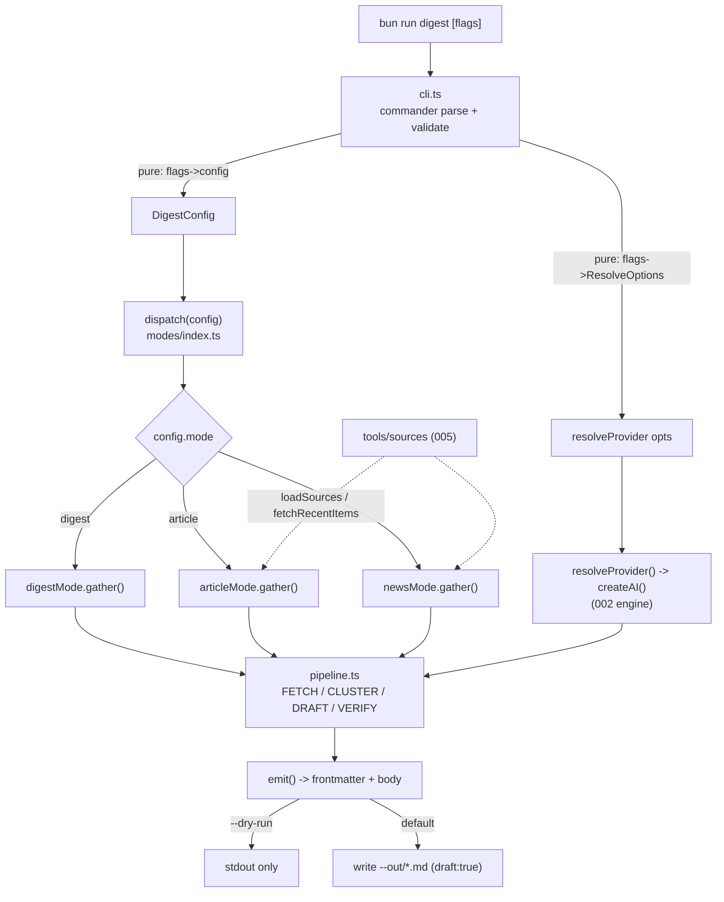

# 004 — Digest CLI & content modes — `plan.md`

**Status:** plan
**Owner (plan):** AI (Zeus)
**Depends on:** 001 (commander), 002 (genkit engine), 003 (dotprompt library)
**Blocks / consumes:** 005 (`tools/sources` interface — consumed here as an import contract)

This is the *how* for the approved [`spec.md`](./spec.md). It turns the single-mode, env-driven digest generator into a real `commander` CLI with three content modes (`digest` / `article` / `news`) and a reading-length knob (`--article-depth`), while preserving the existing weekly-digest behaviour byte-for-behaviour.

______________________________________________________________________

## 1. Overview & approach

Today `tools/digest/index.ts` is a single `main()` that reads behaviour from env vars and runs FETCH → CLUSTER → DRAFT → VERIFY → EMIT against arXiv only. We keep that exact pipeline as the `digest` mode and grow *around* it:

1. **A thin `commander` entry** (`tools/digest/cli.ts`) that parses/validates flags and produces a single, fully-resolved `DigestConfig` object. **No business logic lives in arg parsing** — the parser's only jobs are: type coercion, range/enum validation, and mapping flags onto (a) `resolveProvider` options and (b) `DigestConfig`.
1. **A mode dispatcher** (`tools/digest/modes/index.ts`) that, given a `DigestConfig`, selects one of three **mode strategies**. Each strategy declares *what sources to gather* and *which prompt to draft with*; everything else (FETCH plumbing, VERIFY, EMIT, frontmatter) is shared scaffolding.
1. **Shared stages** (`tools/digest/pipeline.ts`) — the provider-agnostic FETCH/CLUSTER/DRAFT/VERIFY/EMIT helpers, extracted from today's `index.ts` so all three modes reuse them.
1. **Two new prompts** (`prompts/article.prompt`, `prompts/news.prompt`) authored per 003 conventions (no pinned model, `input.schema` declared).

Key principle: **purity at the seams.** Arg parsing, depth→length math, mode/prompt selection, and frontmatter assembly are all pure, synchronous, side-effect-free functions that we unit-test exhaustively. The only impure leaves are `fetchArxiv` (network), `ai.prompt(...)()` (LLM), and `fs.writeFileSync` (disk) — and those are exactly the parts we *cannot* live-test in this env (no API key), so they sit behind thin, individually-mockable functions.

### Backwards-compatibility contract (non-negotiable)

`bun run digest` with **no flags** must behave **identically** to today:

- mode `digest`, `--days-back 7`, categories `cs.AI, cs.LG, cs.CL`, max 40 papers,
- out dir `notes/drafts/ai-digests/`, same frontmatter shape, same `> [!NOTE]`/`> [!WARNING]` banner, same slug `ai-papers-digest-${ISO}`.
- The env vars that exist today (`DIGEST_DAYS_BACK`, `DIGEST_OUT_DIR`, `AI_PROVIDER`, `DIGEST_MODEL`, provider keys) **still work** as lower-precedence defaults under the new flags (flag > env > built-in default). The weekly Action sets `DIGEST_MODEL` via env and calls bare `bun run digest`; that path must stay green.

______________________________________________________________________

## 2. Architecture & key decisions



### Decisions & rationale

| # | Decision | Rationale |
| - | -------- | --------- |
| D1 | **`commander`** for parsing (added by 001). | Spec-mandated; mature, declarative, gives `--help` + validation hooks for free. Plan *depends* on 001 having added it to `package.json`. |
| D2 | **Single resolved `DigestConfig`** produced by a pure `buildConfig(rawOpts)` function; commander's `action` handler just calls it then `dispatch`. | Keeps all validation/coercion testable without spawning a process. The `action` callback is the only commander-coupled code. |
| D3 | **Modes are a strategy interface**, not a `switch` of inline code. | Spec requirement #2. Each mode is a small object `{ name, gather(ctx), promptName, defaultDepth, buildFrontmatter(meta) }`; shared scaffolding calls them uniformly. Adding a 4th mode later = one file. |
| D4 | **Source interface from 005 is imported, never reimplemented here.** Use the exact signatures (`loadSources`, `fetchRecentItems`, `Source`, `SourceItem`). | Aligns 004 and 005; prevents drift. In 004 these are an *interface contract*; 005 ships the impl. |
| D5 | **Degrade loud, never silent.** When `loadSources()` returns `[]` (registry absent), `article`/`news` print a `console.warn` banner *and* inject a visible `> [!WARNING]` callout into the emitted post, then proceed arxiv-only. | Spec quality bar: "never silently pretend to have read the web." Loud in both the console *and* the artifact so a human reviewer sees it. |
| D6 | **Depth → length is a prompt nudge + soft post-check, not truncation.** | Spec: LLMs miss exact lengths; hard truncation would corrupt Markdown/frontmatter. Post-check only *warns* (console + optional callout), never edits the body. |
| D7 | **`--theme` for `digest` = both** (narrow the arXiv query *and* pass as a draft hint). For `article`/`news`, `--theme` also filters/queries registry items (via `fetchRecentItems({theme})`). | Spec open question; "both" is the least-surprising and is what the source interface already supports (`opts.theme`). See §9 for the trade-off. |
| D8 | **`--compile-sources` short-circuits**: if set, `cli.ts` routes to a stub `compileSources()` that (in 004) prints "implemented in 005" and exits 0 — the flag/route exists now so 005 only fills the body. | Spec: declare + route only; don't implement discovery here. |
| D9 | **Keep output `draft: true` and out dir default `notes/drafts/ai-digests/`.** | Spec non-goal: no auto-publish. (Note the schema/out-dir mismatch flagged in §9-Q4 — call out, don't fix here.) |
| D10 | **Env vars remain lower-precedence defaults**, surfaced through commander's `.env()`/default fallbacks rather than read ad-hoc inside the pipeline. | Single source of truth for config precedence; keeps the weekly Action working unchanged. |

______________________________________________________________________

## 3. Full CLI surface

`bun run digest [options]` (entry `tools/digest/cli.ts`; `package.json` `digest` script repointed here — see §6).

| Flag | Type / values | Default | Validation | Maps to |
| ---- | ------------- | ------- | ---------- | ------- |
| `--provider <name>` | `gemini`\|`anthropic`\|`openai` | auto-detect (002) | enum via `isProviderName`; else error listing valid names | `ResolveOptions.provider` |
| `--api-key <key>` | string | provider env var | non-empty if given; **never logged/echoed** | `ResolveOptions.apiKey` |
| `--model <id>` | string | provider default (002) | non-empty if given | `ResolveOptions.model` |
| `--days-back <n>` | int ≥ 1 | `7` (or `DIGEST_DAYS_BACK`) | `Number.isInteger && >=1`; else error | `DigestConfig.daysBack` → `fetchArxiv` + prompt vars |
| `--theme <text>` | string | none | trimmed; empty → treated as unset | `DigestConfig.theme` → arXiv query + prompt + `fetchRecentItems` |
| `--article-depth <n>` | int 1–10 | per-mode (see §5) | `Number.isInteger && 1..10`; else error | `DigestConfig.depth` → length target |
| `--article-type <mode>` | `digest`\|`article`\|`news` | `digest` | enum; else error | `DigestConfig.mode` → dispatcher |
| `--compile-sources` | boolean | `false` | — | short-circuit → `compileSources()` (005) then exit |
| `--out <dir>` | path | `notes/drafts/ai-digests/` (or `DIGEST_OUT_DIR`) | non-empty | `DigestConfig.outDir` → `emit` |
| `--dry-run` | boolean | `false` | — | `DigestConfig.dryRun` → print to stdout, write nothing |

`--help` is generated by commander and **augmented with an `addHelpText('after', …)` examples block**:

```text
Examples:
  bun run digest                                  # weekly digest, last 7 days (unchanged)
  bun run digest --article-type article --article-depth 6 --theme "agents"
  bun run digest --article-type news --days-back 3
  bun run digest --provider openai --model gpt-4o --dry-run
  bun run digest --compile-sources                # (re)build the source registry [005]
```

Validation errors exit non-zero with a one-line, actionable message (mirroring `resolveProvider`'s style). **No flag value containing the API key is ever printed**, including in error messages and the startup `AI provider:` line.

______________________________________________________________________

## 4. The three modes

All modes share: provider resolution, EMIT/frontmatter contract, VERIFY pass, `--dry-run`, depth handling. They differ only in **source-gather** and **draft prompt**.

| Aspect | `digest` (default) | `article` | `news` |
| ------ | ------------------ | --------- | ------ |
| Sources | arXiv only (cs.AI, cs.LG, cs.CL) | arXiv **+** registry items (researcher/lab/company blogs) | registry items **primary** (releases, lab/company posts); arXiv optional/secondary |
| Cluster step | yes (3–5 themes) | yes (themes over papers+items) | optional — group by recency/topic, lighter |
| Draft prompt | `draft.prompt` (unchanged) | `article.prompt` (new) | `news.prompt` (new) |
| Thesis requirement | no — neutral synthesis | **must make ≥1 explicit, defended thesis** | no — "did you hear about this," newsworthy framing |
| Recency emphasis | within `--days-back` | balanced | **strong** — newest first, "you may have missed" |
| Links out | arXiv URLs | arXiv URLs + source `url` | source `url` per item (primary value) |
| Fact-check (VERIFY) | vs. abstracts | vs. abstracts **+** `SourceItem.summary` | vs. `SourceItem.summary` (+ abstracts if used) |
| Default depth | 3 | 5 | 4 |
| Registry-absent behaviour | n/a | **degrade loud** → arxiv-only + WARNING (D5) | **degrade loud** → arxiv-only + WARNING (D5) |
| Frontmatter `category` / `tags` / title | `ai-research` / weekly-digest tags / "AI Papers This Week — …" (unchanged) | `ai` / thesis-topic tags / thesis-derived title | `ai-news` / release/news tags / "AI News — …" |

### Source-gather contract (consumes 005)

```ts
import { loadSources, fetchRecentItems, type SourceItem } from '../sources'

// inside article/news gather():
const sources = loadSources()                       // [] if registry file absent
if (sources.length === 0) {
  warnDegraded(mode)                                 // console.warn + flag for callout
} else {
  const { items, failures } = await fetchRecentItems(sources, { daysBack, theme })
  for (const f of failures) console.warn(`source "${f.source}" failed: ${f.error}`)
  // items feed CLUSTER/DRAFT/VERIFY alongside (or instead of) papers
}
```

`warnDegraded` returns a flag the EMIT step turns into a visible `> [!WARNING] Registry unavailable — this post was generated from arXiv only.` callout, so the degradation is recorded in the artifact, not just the terminal (D5).

### New prompts (003 conventions: no `model:`, declare `input.schema`)

`prompts/article.prompt` — system role: "engineering audience, no hype; you are writing an **opinionated** post that defends a clear thesis grounded in the supplied papers/sources; state the thesis up front." Inputs: `themesAndSources: string`, `date: string`, `theme: string`, `targetWords: integer`, `sourceCount: integer`. Output: Markdown body only.

`prompts/news.prompt` — system role: "surface newsworthy AI announcements/releases/events a reader may have missed; lead with the most recent; link every item; terse, no hype." Inputs: `items: string`, `date: string`, `theme: string`, `targetWords: integer`. Output: Markdown body only.

(`cluster.prompt` and `verify.prompt` are reused as-is; `verify` is fed a combined `abstracts`+source-summaries string for article/news.)

______________________________________________________________________

## 5. `--article-depth` → length mapping (concrete)

Reading speed ≈ **200 wpm**. Depth is the dial; we compute target words, embed them as a prompt nudge (`targetWords`), and run a **soft post-check** that only warns.

Curve (interpolated linearly between the spec's anchor points, rounded to the nearest 50 words):

```ts
// tools/digest/depth.ts — PURE
const ANCHORS: ReadonlyArray<[depth: number, words: number]> = [
  [1, 300], [3, 700], [5, 1100], [7, 1700], [10, 2500],
]

/** depth (1..10) -> target word count, piecewise-linear between anchors. */
export function depthToWords(depth: number): number { /* clamp + interpolate + round50 */ }

/** target minutes-to-read at ~200 wpm, for the prompt nudge + help text. */
export function depthToMinutes(depth: number): number {
  return Math.max(1, Math.round(depthToWords(depth) / 200))
}

/** soft check: returns a human warning string if body length is wildly off. */
export function lengthWarning(bodyWords: number, target: number): string | null {
  // warn only outside [0.6, 1.6] * target — generous band; never throws/truncates.
}
```

Resulting table (matches the spec anchors, fills the gaps):

| depth | target words | ~minutes |
| ----- | ------------ | -------- |
| 1 | 300 | 1–2 |
| 2 | 500 | ~3 |
| 3 | 700 | ~4 |
| 4 | 900 | ~5 |
| 5 | 1100 | ~6 |
| 6 | 1400 | ~7 |
| 7 | 1700 | ~8 |
| 8 | 2000 | ~10 |
| 9 | 2250 | ~11 |
| 10 | 2500 | ~12+ |

`bodyWords` = whitespace-split count of the draft body (excludes frontmatter/banner). The warning surfaces on the console and (optionally) as a `> [!NOTE]` line so the reviewer knows length drifted; **the body is never edited**.

______________________________________________________________________

## 6. File-by-file task list

### Create

- **`tools/digest/cli.ts`** — `#!/usr/bin/env bun`. Builds the `commander` program (all flags from §3 + examples help text), `action(rawOpts)` → `buildConfig(rawOpts)` → if `compileSources` route to stub else `run(config)`. Top-level `main().catch(...)` mirrors today's error/exit handling.
  - `export function buildConfig(raw: RawOpts): DigestConfig` — **pure**: coerce/validate, apply per-mode default depth, fold env defaults, split out `ResolveOptions`. Throws actionable errors.
  - `export function buildProgram(): Command` — returns the configured commander instance (lets tests parse argv without executing the action).
- **`tools/digest/config.ts`** — types: `DigestConfig { mode: Mode; daysBack: number; theme?: string; depth: number; outDir: string; dryRun: boolean; provider: ResolveOptions }`, `type Mode = 'digest'|'article'|'news'`, plus `DEFAULT_DEPTH: Record<Mode, number>` = `{digest:3, article:5, news:4}` and `MODE_DEFAULTS` (category/tags/title-fn per mode).
- **`tools/digest/depth.ts`** — pure curve from §5 (`depthToWords`, `depthToMinutes`, `lengthWarning`).
- **`tools/digest/pipeline.ts`** — shared stages extracted from `index.ts`:
  - `fetchPapers(cfg)`, `cluster(ai, papers)`, `draft(ai, promptName, vars)`, `verify(ai, sources, body)`, and `emit(cfg, body, verdict, meta)` (frontmatter assembly).
  - `export function buildFrontmatter(meta: EmitMeta): string` — **pure** (no `fs`); `emit` calls it then writes (or, under `--dry-run`, prints). This is the unit-testable core of the frontmatter contract.
- **`tools/digest/modes/index.ts`** — `Mode` strategy registry + `dispatch(cfg)`; `selectMode(mode): ModeStrategy`.
- **`tools/digest/modes/digest.ts`** — wraps today's exact behaviour (gather=arxiv, prompt=`draft`, frontmatter=current). Golden-path for backwards-compat.
- **`tools/digest/modes/article.ts`** — gather=arxiv+registry (D5 degrade-loud), prompt=`article`, thesis-oriented frontmatter.
- **`tools/digest/modes/news.ts`** — gather=registry-primary (D5 degrade-loud), prompt=`news`, news frontmatter.
- **`tools/digest/sources-stub.ts`** *(only if 005 not yet merged when 004 lands)* — re-exports a local placeholder matching the 005 interface so 004 typechecks/tests standalone; deleted/redirected to `../sources` once 005 merges. Prefer importing `../sources` directly if 005 is already in.
- **`prompts/article.prompt`**, **`prompts/news.prompt`** — per §4.
- **Tests** (bun:test, colocated): `cli.test.ts`, `depth.test.ts`, `pipeline.test.ts` (frontmatter), `modes/index.test.ts`.

### Modify

- **`tools/digest/index.ts`** — slimmed to a **compat shim**: re-export `run`/`buildConfig` *or* simply `import './cli'` so the historical path `bun tools/digest/index.ts` still works. (Keeps any external reference to `index.ts` alive; the spec lists both entry points.)
- **`package.json`** — `"digest": "bun tools/digest/cli.ts"`. (Keep `index.ts` working via the shim so the change is safe.)
- **`prompts/README.md`** — add `article.prompt` / `news.prompt` rows to the "Current prompts" table.
- **`.github/workflows/weekly-digest.yml`** — **no change required** (still `bun run digest`, defaults = `digest` mode). Add a one-line comment noting modes exist now. Verify the script repoint doesn't break it.

### Do **not** touch

`tools/ai/*` (engine is 002), `tools/digest/arxiv.ts` (already mode-ready), `src/content.config.ts`, `bin/`.

______________________________________________________________________

## 7. Sequencing & dependencies

1. **Pre-req:** 001 has added `commander` to `package.json` deps. If not present, this plan is blocked — `bun add commander` is 001's job, not 004's. Confirm before starting.
1. **Extract first, behaviour-preserving:** move stages out of `index.ts` into `pipeline.ts` + `modes/digest.ts` with **zero behaviour change**; prove via the frontmatter golden test before adding flags. (Refactor under test.)
1. **Add `config.ts` + `depth.ts`** (pure, fully testable, no engine).
1. **Add `cli.ts`** (commander) wiring config → dispatch; test `buildConfig`/`buildProgram` purely.
1. **Add `article`/`news` modes + prompts**, consuming the **005 source interface** as an import. Until 005 merges, either (a) land 005 first, or (b) use `sources-stub.ts` so 004 is self-contained; the degrade-loud path (registry → `[]`) is the natural default and is itself testable without 005.
1. **Repoint `package.json`**, add the `index.ts` shim, update docs.

**Cross-plan contract (must match 005 exactly):** `Source`, `SourceItem`, `loadSources(path?)`, `fetchRecentItems(sources, {daysBack, theme})`. 004 imports; 005 implements. The degrade-loud behaviour when `loadSources()` returns `[]` is owned by 004.

______________________________________________________________________

## 8. Test plan

**No API key in this env → no live generation.** Everything that touches `ai.prompt(...)()` or `fetchArxiv` is mocked or skipped; the testable surface is deliberately pure.

### Pure unit tests (run in CI, no network/keys)

- **`depth.test.ts`** — `depthToWords` hits each spec anchor exactly (1→300, 3→700, 5→1100, 7→1700, 10→2500); interpolates monotonically; clamps `0`→depth1, `99`→depth10, non-integers handled; `depthToMinutes` sane; `lengthWarning` returns `null` inside band, a string outside, and **never** mutates/truncates.
- **`cli.test.ts`** — drive `buildProgram().parse([...], {from:'user'})` / `buildConfig(raw)`:
  - defaults: no flags → `{mode:'digest', daysBack:7, depth:3, outDir:'notes/drafts/ai-digests/', dryRun:false}`.
  - per-mode default depth: `--article-type article` → depth 5; `news` → 4; explicit `--article-depth` always wins.
  - validation: `--article-depth 0/11/abc` rejected; `--article-type bogus` rejected; `--provider bogus` rejected; `--days-back 0/-1/x` rejected — each with a non-zero-exit, actionable message.
  - precedence: flag > env (`DIGEST_DAYS_BACK`, `DIGEST_OUT_DIR`, `AI_PROVIDER`, `DIGEST_MODEL`) > built-in default.
  - **key never leaks:** assert `--api-key secret` never appears in any console output / thrown message (spy on `console.*`).
- **`modes/index.test.ts`** — `selectMode('digest'|'article'|'news')` returns the right strategy with the right `promptName` (`draft`/`article`/`news`) and `defaultDepth`; unknown mode throws.
- **`pipeline.test.ts`** — `buildFrontmatter(meta)`:
  - digest meta reproduces **today's exact frontmatter** (title/date/permalink `/YYYY/MM/DD/slug.html`/category/tags/description/`comments:true`/`draft:true`) — golden snapshot guards backwards-compat.
  - `verdict.ok=false` → `> [!WARNING]` banner with issues; `ok=true` → `> [!NOTE]`.
  - article/news metas produce their distinct category/tags/title and the **degrade-loud `> [!WARNING]`** callout when the registry-absent flag is set.
  - permalink always matches the content-schema regex `^\/\d{4}\/\d{2}\/\d{2}\/.+\.html$` (assert against the same regex).

### Mocked integration (CI-safe)

- A `run(config)` test with `createAI`/`ai.prompt` and `fetchArxiv` **stubbed** to return fixtures, asserting: mode → prompt selection, `--theme`/`--days-back` thread into the fetch + prompt vars, `--dry-run` writes **nothing** (spy on `fs.writeFileSync`) and prints to stdout, normal run writes one `.md` to `--out`.
- Degrade-loud: `loadSources` stubbed to `[]` → `console.warn` fires **and** emitted body contains the WARNING callout.

### Not unit-tested (documented as manual / key-gated)

- Real LLM quality (thesis presence in `article`, recency in `news`, depth→length adherence) — needs a key; verify manually with `--dry-run` once a key is available. Note in PR.

### Build gate

`bun run build` (Astro) validates emitted frontmatter against the Zod content schema — the real acceptance gate for "valid draft post." Keep `bun run typecheck` (`tools/tsconfig.json`) and `bun test tools/` green; CI (`.github/workflows/ci.yml`: install → typecheck → test → build) covers all of the above. Lint/format via Biome (001).

______________________________________________________________________

## 9. Risks & open questions

- **Q1 — Default depth per mode.** Plan adopts the spec's lean: `digest 3, article 5, news 4` (D3/§5). Cheap to change in `DEFAULT_DEPTH`. Confirm.
- **Q2 — `--theme` semantics.** Plan picks **both** (query + filter + prompt hint) for all modes (D7). Risk: a too-narrow theme + small `--days-back` yields zero papers → we already handle "no papers, exit" gracefully; for article/news we'd then *also* hit degrade-loud if the registry is empty. Acceptable; surfaced as a console warning. Alternative (query-only) is simpler but less precise — confirm preference.
- **Q3 — 005 ordering.** 004's `article`/`news` *consume* `tools/sources`. If 005 isn't merged first we need `sources-stub.ts` (§6) to keep 004 self-contained. Decide merge order: **land 005 first** is cleaner; otherwise stub. Either way the degrade-loud path is the default and is fully testable without 005.
- **Q4 — Out-dir vs. content schema mismatch (flag, do not fix here).** EMIT writes to `notes/drafts/ai-digests/`, but `src/content.config.ts` globs `src/content/blog/**`. The weekly Action's PR body even says "review the post in `src/content/blog/`." So generated drafts are **not** currently picked up by the Astro collection / build-gate unless moved. This predates 004 and the spec says "keep current default," so 004 preserves it — **but** it means the "passes the Astro content schema" quality bar isn't actually exercised by the default out dir. Recommend a follow-up (separate chunk) to reconcile out-dir ↔ collection base, or to add the drafts dir to the glob. Needs a human call.
- **Q5 — VERIFY cost on article/news.** Feeding combined abstracts+source summaries grows the verify prompt; token cost scales with `--days-back` × sources. Mitigation: the existing `MAX_PAPERS` cap + a per-mode item cap. Confirm acceptable spend.
- **Q6 — `--compile-sources` stub UX.** In 004 it prints "implemented in 005" and exits 0. Risk of looking like a no-op success. Mitigation: clear message + exit code 0 (not an error — it's a known-deferred feature). Confirm wording.

______________________________________________________________________

## 10. "Done when" (acceptance, mapped to the spec quality bar)

- [ ] `bun run digest` (no flags) produces a draft **byte-compatible** with today's output (golden frontmatter test + manual diff); weekly Action path unchanged.
- [ ] `commander` parses/validates the full flag surface (§3); invalid `--article-depth` / `--article-type` / `--provider` / `--days-back` are rejected with actionable, non-zero-exit messages.
- [ ] `--help` is self-explanatory with an examples block; a new user can run each mode from it alone.
- [ ] Three modes exist as strategies sharing FETCH/EMIT; `digest`/`article`/`news` select `draft`/`article`/`news` prompts respectively; `prompts/article.prompt` + `prompts/news.prompt` follow 003 conventions (no model, `input.schema`).
- [ ] `--days-back` and `--theme` thread through FETCH and into prompt variables.
- [ ] `--article-depth` maps to target words per §5; output length moves in the expected direction (manual, key-gated); soft post-check warns, never truncates.
- [ ] `article`/`news` consume the 005 `tools/sources` interface and **degrade loud** (console.warn + in-post WARNING) when the registry is absent — verified by test.
- [ ] EMIT keeps the frontmatter contract (permalink/category/tags/`draft:true`, verifier banner) and honours `--out`; `--dry-run` writes nothing (verified by spy).
- [ ] API keys never appear in any output or error (verified by test).
- [ ] `bun run typecheck`, `bun test tools/`, and `bun run build` all green in CI.
