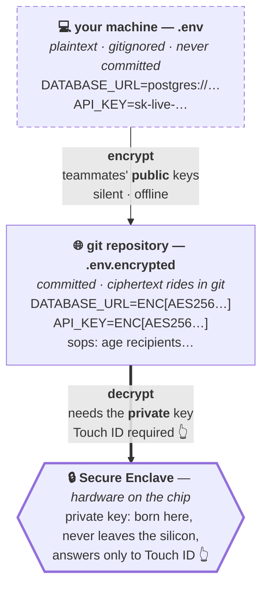
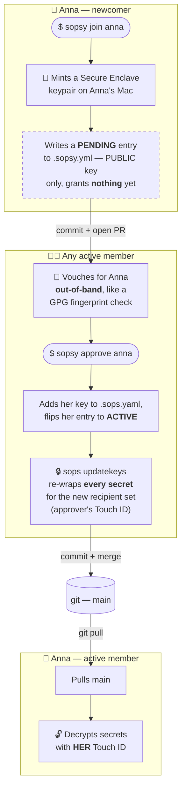

Well, I did a thing I've wanted to do for a while: I published **[sopsy](https://github.com/kigster/sopsy)** — my **first open-source package written in Rust** — to [crates.io](https://crates.io/crates/sopsy) and to Homebrew. After a couple of decades of shipping Ruby, some C, and an unreasonable amount of Bash, watching `cargo publish` go green on a crate of my own felt genuinely great. I am allowing myself a small victory lap before Rust inevitably finds a new way to humble me.

> And like all the "cool kids" these days, of course it has its own snazzy website, because apparently a CLI is not real until it has a domain name. Visit <a href="https://sopsy-cli.dev" target="_blank">sopsy-cli.dev</a> now, or after you're done reading.

## What is it, and why might you care?

**sopsy lets your team commit its secrets — encrypted — directly into git, where each developer holds their own private key inside their Mac's Secure Enclave, and decryption takes a fingerprint.** There's no shared master key (the single thing that ultimately sank my last attempt at this, more on that below). No secrets server to run or pay for. No plaintext `.env` quietly making the rounds on Slack. Adding a teammate is a pull request; removing one re-keys every file automatically.

Who is it for? Teams that want **tight, revocable control over exactly who can decrypt the developer secrets they keep in git** — small-to-mid engineering teams, open-source projects, and security-conscious startups that would rather not stand up Vault just to stop passing `.env` files around by hand. It is deliberately bottom-up: one developer installs it, tries it on a repo, and brings the rest of the team along. macOS-first for the hardware bits, today.

The mental shift, compressed for the busy:

> A shared symmetric key (or a `.gitignore`) asks you to **guard one secret everyone copies.**
> sopsy lets each person **hold their own key in hardware** — and re-keys the team when membership changes.

## What it actually is

First, the honest framing, because security tools get insufferable very quickly: **sopsy does not reimplement any cryptography.** It stands on three excellent, boring, battle-tested tools that are kind of annoying to learn and use, and makes them, in my opinion, a lot more pleasant to live with:

- **[SOPS](https://github.com/getsops/sops)** — Mozilla's secrets operator, which cleverly encrypts the *values* in a file while leaving the *keys* readable, so a diff still tells you "`DATABASE_URL` changed" or when the "`OPENAI_API_KEY`" was added, without leaking what it changed to.
- **[age](https://github.com/FiloSottile/age)** — Filippo Valsorda's modern, no-options-to-get-wrong encryption, the spiritual antidote to GPG.
- **[age-plugin-se](https://github.com/remko/age-plugin-se)** — the bit that made me warm and fuzzy: it generates an age identity whose **private key is born inside your Mac's Secure Enclave and physically cannot leave it.** Decryption requires Touch ID. The key isn't on disk for malware to find, because it was never on disk at all. The fact that macOS has a [Secure Enclave](https://support.apple.com/guide/security/the-secure-enclave-sec59b0b31ff/web) sitting there, quietly waiting to solve exactly this problem, was a huge surprise to me. But at the same time, it wasn't.

sopsy is the friendly Rust CLI that orchestrates all three: it bootstraps a repo, manages who can decrypt, re-keys everything when membership changes, and ships a CI gate that fails the build the instant a plaintext secret sneaks in. SOPS stays the engine; sopsy is the steering wheel, the seatbelt, and the annoying little dashboard light that tells you when you are about to do something dumb.

Here's the shape of it:



The whole trick is that arrow at the bottom. Encryption only needs your teammates' **public** keys, so it's silent and offline. Decryption needs the **private** key, which lives in silicon and answers only to your fingerprint. The ciphertext rides happily in git; the thing that unlocks it never does.

### The five-minute tour

You start a repo the way you'd hope:

```bash
git init my-app && cd my-app
sopsy init          # checks your tools, mints a Secure Enclave identity, writes the config
sopsy edit .env.encrypted   # opens your $EDITOR; decrypts in, re-encrypts on save (Touch ID)
sopsy check         # the CI gate: fails if any plaintext secret is tracked
git add .sops.yaml .sopsy.yml .env.example .env.encrypted .gitignore
git commit -m "Encrypted secrets, managed by sopsy"
```

`sopsy init` prints your **public recipient** — an `age1se1…` string — and that's the only part of your identity that's ever shared or committed. For day-to-day use there's also `sopsy decrypt` (and `sopsy secrets decrypt`), which streams plaintext to stdout, so you can wire it into [direnv](https://direnv.net) and unlock the whole environment once per shell instead of fighting it per-command:

```bash
# .envrc — one Touch ID when you cd in, then your secrets are just there
eval "$(sopsy decrypt .env.encrypted | sed -E '/^#/d; /^$/d; s/^([A-Z])/export \1/g')"
```

> [!TIP]
> If Touch ID on every read gets old — you live in `direnv`, or you run a dozen windows on one project — you can mint your Enclave key **without** a biometric gate: `sopsy join "Your Name" --without-touch-id`. The private key still never leaves the Enclave and is still device-bound; it just no longer prompts. This is a deliberate trade: less thumb, less ceremony.

### Where it gets good: the team model

A shared symmetric key has no notion of "who." sopsy does, and that's the whole reason it works for a team. Two files carry the state:

- **`.sops.yaml`** — consumed by SOPS itself: a list of **public** recipient keys that any new secret gets encrypted to.
- **`.sopsy.yml`** — sopsy's own ledger: human names, who owns which key, lifecycle state, a small **audit trail** (who requested access and when, who approved them and when), and the break-glass marker. A committed `.sopsy.sha` checksum makes hand-edits tamper-evident instead of silently trusted.

Onboarding is **self-service**, which is the part that actually changes how a team feels. A newcomer doesn't chase anyone for a key; they mint their own and send the *public* half in a pull request:



Note what a "pending" join grants: **nothing.** The newcomer's key isn't in `.sops.yaml` yet, so it can't decrypt anything — the request is just a public key sitting in a PR. (`sopsy join` is also aliased `sopsy request-access`, if that reads better in your team's docs.) An existing member reviews it, vouches that the key really belongs to Anna — you confirm that out-of-band, the same way you'd confirm a GPG fingerprint — and `sopsy approve` does the rest: adds the key, re-wraps the data key for the new recipient set with `sops updatekeys`, and flips Anna to active. Offboarding is the mirror image. No shared secret, no master password, no "we should probably rotate that someday."

And because every developer's private key is hardware-bound, there are two deliberate safety valves for the cases where a fingerprint isn't available:

- **Break-glass** — a portable age key you generate once, store offline in 1Password, and register as an emergency recipient. If everyone's laptop falls in the ocean, that one offline key can still open and re-key the repo. `sopsy` nags you until you make one, and after this week I understand exactly why.
- **CI decryption** — `sopsy recipient ci` runs the same guided ceremony to hand your pipeline a portable key: one CI secret named `SOPS_AGE_KEY`, and your workflows can decrypt. The Secure Enclave, correctly, will never work headless — so this is how CI reads secrets without one.

## A little history: how I got here

Nine years ago I wrote a little tool called [sym](/2017/03/10/dead-simple-encryption-with-sym.html) and wrote a blog post about it.

I opened the post with a complaint that has aged distressingly well: keeping your secrets *out* of git, in a pile of `.gitignored` files, gives you a **false sense of security** and costs you everything good about version control. No history. No rollback. No diff. And the eternal team tax of "hey, can you AirDrop me the `.env` again? mine's three weeks stale."

The dream and ambition back then was not quite the same as today, but close: I just *didn't want to have plain text secrets lying around in my repos*, even if they were git-ignored. Ideally, I wanted to encrypt them and check them in. Pre-commit hooks existed back then, so committing a plaintext secret to git was less of an issue. But "keys to many kingdoms" just lying around on my file system in plain text, waiting for someone to break in and steal them — that bothered me, annoyingly and continuously. So I wrote *sym* — a symmetric encryption Ruby gem with a couple of macOS-specific twists. And for 2017 it wasn't so bad.

> `sym` is a Ruby gem that used OpenSSL encryption underneath, so that part was solid. You generated a symmetric key, and you could encrypt your secrets and commit them to your repo as one text blob (encrypted data was also base64 encoded). You had one master key in 1Password, and when you "onboarded" someone, you'd grab that master key, and they would import that key using `sym` into OS X Keychain, in the process wrapping the key in an additional layer of password-protected encryption. Now you could git-commit the secrets, and to decrypt them on your machine required your password (whatever you assigned during the import). That was also a bonus. **But a single master key was now the one thing that, if leaked, rendered the entire process completely pointless.** And in that sense, some security people would say things like *"Great tool, it gives you a warm and fuzzy feeling of protection, without actually providing it"...*

It had a few conveniences too — you could request that your password be cached in a local memcached instance, although there I got lazy and cached it in clear text. Security via obscurity, right?

Still, it was way better than everyone sharing a plain text file with two dozen API keys that, if stolen, could have been used to rack up significant fees for the company, not to mention access some private data, which would have been way worse.

So? That was fine for 2017, and a few projects I was on adopted it. It did not become a hit, because shortly thereafter Rails launched credentials, which, although it lacked the convenience of the password-protected and Keychain-stored encryption key, ultimately allowed you to keep encrypted credentials in the repo. With the popularity of Rails, there was no competition.

Having recently been on a project where the `.env` file contained nearly one hundred various secrets and API keys, I thought to myself, maybe we can do better in 2026?

### The research

After numerous conversations with Claude and ChatGPT about the best existing secrets-encryption tools for developers, and specifically — *in the development environment* — I kept coming back to the same question.

Production systems in the cloud have matured. If you're running on AWS, your keys are in KMS. If you're a Terraform nut, probably Vault. But locally, on your development MacBook, what is the preferred method to avoid keeping "keys to the kingdoms" lying around in plain text?

Surely, the tool that encrypts your dev secrets and does not depend on a single symmetric key has been written by now? Well, maybe it has. But the three of us (the two AI agents and myself) could not find anything that did what I wanted, with the ease of use I had in mind.

Having identified a potential hole in the developer tooling, and having collected information about the modern tools people use for encryption and key management, I concocted a plan. So over the last few days Claude and I built **[sopsy](https://github.com/kigster/sopsy)** — a Rust-based CLI for doing what I wanted in 2017, but could not quite build then without hand-waving around the most important part.

## A parade of excellent bugs

Now the fun part — and the honest part. I built sopsy over a handful of days pairing with an AI coding agent, and here's the detail I keep turning over: **the agent wrote clean, well-tested code that passed its own suite green, and almost every real bug was found the moment a human actually *used* the thing.** Not in CI. In my hands, on two real macOS accounts, with my actual thumb. That gap — between "the tests pass" and "it works for a person" — is the whole story of this section, and frankly the whole story of [evals](/2026/06/22/writing-evals-for-ai-powered-apps.html) too. Determinism in the test suite is not correctness in the world.

Here are the ones worth your time.

### 1. The key that wasn't there

The first real run of `sopsy init` ended with the most confusing class of failure: success, then nothing worked. It generated my Secure Enclave identity, encrypted the file, reported victory — and then every decrypt failed with `age: identity did not match any of the recipients`.

The cause is a beautiful little misunderstanding about how `age-plugin-se` works. When it generates a key, it hands you back a long `AGE-PLUGIN-SE-1…` string. It is tempting — and wrong — to treat that string as a throwaway, because "the private key is in the Enclave, so who cares." But that string is the **handle**: the reference SOPS needs to ask the Enclave to unwrap anything. We were generating it and dropping it on the floor. The private key was safe in the Enclave, all right — and totally unaddressable, like a safe deposit box whose number you dropped in the toilet and accidentally flushed.

> [!NOTE]
> The fix is the distinction worth internalizing: **the handle is not the secret.** It only works on *this* device, behind *this* fingerprint, so it is perfectly safe to write to disk — and you *must*, or the Enclave key is useless. `sopsy` now persists it to the standard `sops` keys file and points every SOPS call at it. The private key still never leaves the chip. The map to it just needs to exist.

### 2. The `init` that ran forever

Early on, a teammate (me, in a different mood) ran `sopsy init` in the wrong directory — one that wasn't a fresh repo, so git happily walked *up* and decided the enclosing repository was my entire home folder. sopsy then tried to find every encrypted file to re-key it by... reading every file under the repo root. All of `$HOME`. It was still going, fans spinning, several minutes and a few gigabytes of `node_modules` later.

> [!WARNING]
> An unbounded "scan everything" is a bug that hides until someone points it at a big enough directory, and then it's a hang, not an error — the worst kind. The fix was to stop walking the filesystem and instead expand the declared encrypted-file globs directly (a `*` that never crosses a `/`), so the scan touches the directories the patterns actually name and nothing else. And `init` now refuses to silently adopt your home directory as a secrets repo — it stops and asks.

### 3. The secret that couldn't be committed (and then couldn't be shared)

This one was a two-part trap, and it's my favorite because each half was invisible without the other.

The default `.gitignore` sopsy wrote was a touch too greedy. It ignored `.env.*` to keep stray dotenv files out of git — sensible! — but `.env.example.encrypted` matches `.env.*` too. So the one file you *wanted* committed was quietly untracked. That's part one.

Part two: when a new member was approved, the re-key step enumerated files via `git ls-files`. Reasonable, except that command deliberately skips ignored files — so the encrypted artifact that part one had just hidden was *also* skipped during re-keying. The new member got added to `.sops.yaml`, everything reported success, and then they couldn't decrypt one of the files, because they'd never been added to it.

> [!TIP]
> The lesson is a clean little invariant: **encrypted artifacts are first-class committed files, full stop.** The gitignore now explicitly rescues every `*.encrypted` no matter what, and re-keying enumerates secrets by globbing the working tree — not by asking git, which has opinions about what's worth mentioning. When two reasonable behaviors compose into one wrong behavior, the invariant was wrong or incomplete. That is where the bug was hiding.

### 4. `sudo` cannot touch the Enclave (and that's the point)

I tested the two-person flow with two macOS accounts on one laptop, and switched between them with `sudo su - arc`. Decryption failed every time, no Touch ID prompt, just the same flat "no identity matched." I was *certain* this was a sopsy bug. It is not a sopsy bug.

The Secure Enclave will only release a key to the user's **active GUI login session.** `sudo`, `su`, SSH — none of them can raise the biometric prompt, so the Enclave just says no. The instant I used **Fast User Switching** to actually log `arc` in at the screen, the prompt appeared, my thumb did its thing, and the secret opened.

> [!IMPORTANT]
> This isn't a wart, it's the **threat model doing its job.** A key you can use over SSH is a key an attacker can use over SSH. Hardware-bound, presence-required decryption is exactly what you want for production secrets — and it's precisely why the portable break-glass and CI keys exist for the headless cases where the Enclave, correctly, won't play. Touch ID is per-account, too: each user enrolls their own fingerprint, falling back to that account's login password.

There were smaller ones — my own tests cheerfully writing fake keys into my *real* keystore, a Homebrew install shadowing the freshly-built `cargo` binary on `$PATH` so I kept testing the old bits — but the four above are the ones that taught me something. Every single one survived a green test suite and died on contact with a human. Annoying? Yes. Useful? Also yes.

## sopsy in one glance

The whole feature set, for the skimmers:

- **One-command bootstrap** — `sopsy init` writes `.sops.yaml`, `.env.example`, an encrypted `.env.encrypted`, `.gitignore` safety rules, and `.sopsy.yml`. Idempotent, so re-running is always safe.
- **Secure Enclave identities** — your private key is generated inside Apple Silicon hardware, gated by Touch ID, and impossible to read or exfiltrate. `--without-touch-id` if you want it device-bound but prompt-free.
- **Self-service membership with an audit trail** — `sopsy join` (alias `request-access`) records a *pending* request; any active member `sopsy approve`s. `.sopsy.yml` keeps who asked, their username, when, and who approved them and when; `sopsy recipient list` prints it all.
- **Automatic re-keying** — every add / remove / approve re-wraps all secrets via `sops updatekeys`, so the recipient set never drifts from the ciphertext.
- **Friendly edits + scriptable crypto** — `sopsy edit` opens an encrypted file in your `$EDITOR` with auto file-type detection; `sopsy encrypt` / `sopsy decrypt` (and the `secrets` forms) do one-shot, `direnv`-friendly crypto to stdout or a file.
- **Break-glass + CI ceremonies** — `sopsy recipient break-glass` mints an offline emergency key; `sopsy recipient ci` mints a portable CI decryption key (one `SOPS_AGE_KEY` secret and your pipeline can decrypt).
- **Tamper-evident config** — a committed `.sopsy.sha` checksum over `.sopsy.yml` + the admin key is refreshed on write and verified on read, so hand-edits are surfaced, not silently trusted.
- **A CI gate that bites** — `sopsy check` enforces hygiene invariants and exits non-zero on any tracked plaintext. It needs no key, so it runs on a Linux runner.
- **`sopsy doctor`** — a grouped, colorful health report of your tools, Secure Enclave, Touch ID, and repo that you can paste straight into a GitHub issue.

## Your turn

If you keep secrets in git today — or you've been getting away with a shared `.env` and quietly worrying about it — I'd genuinely love to hear how your team handles this. What are you using? What would stop you from committing encrypted secrets right next to the code? Install it (`brew install kigster/tap/sopsy` or `cargo install sopsy`), point it at a throwaway repo, and tell me what breaks.

**Leave a comment below** — bug reports, "you reinvented X," and "why not just use Y" are all equally welcome. And if it's useful to you, a star on [GitHub](https://github.com/kigster/sopsy) helps more people find it.

Go encrypt something. Then try to commit it. That part is supposed to feel good now.

— Konstantin Gredeskoul

San Francisco, CA, June 28, 2026.


> [!NOTE]
> **In the spirit of full disclosure**: sopsy was written over a few days pairing with an AI coding agent, and the experience is the quiet subtext of this whole post. The agent was a frankly excellent programmer — clean Rust, real tests, all green. And it could not, on its own, find a single one of the bugs above, because every one of them required a human, a thumb, two login sessions, and a fair bit of swearing. The code was AI-built; the *correctness* and *validation* came from me yelling at Claude, compacting the context more than once, and generally being pretty annoyed with it. Keep a human in the loop, especially the one holding the finger and the fingerprint.

## References

- [sopsy on GitHub](https://github.com/kigster/sopsy) — source, install instructions, and the owner/member guides.
- [sopsy on Crates.io](https://crates.io/crates/sopsy) — where you'd install it from.
- [SOPS](https://github.com/getsops/sops) · [age](https://github.com/FiloSottile/age) · [age-plugin-se](https://github.com/remko/age-plugin-se) — the three tools sopsy stands on.
- [Dead Simple Encryption with Sym](/2017/03/10/dead-simple-encryption-with-sym.html) — the 2016-era ancestor, and the problem statement that still holds.
- [Evals: The Unit Tests for the Non-Deterministic Parts of Your App](/2026/06/22/writing-evals-for-ai-powered-apps.html) — more on the gap between "tests pass" and "it works."
