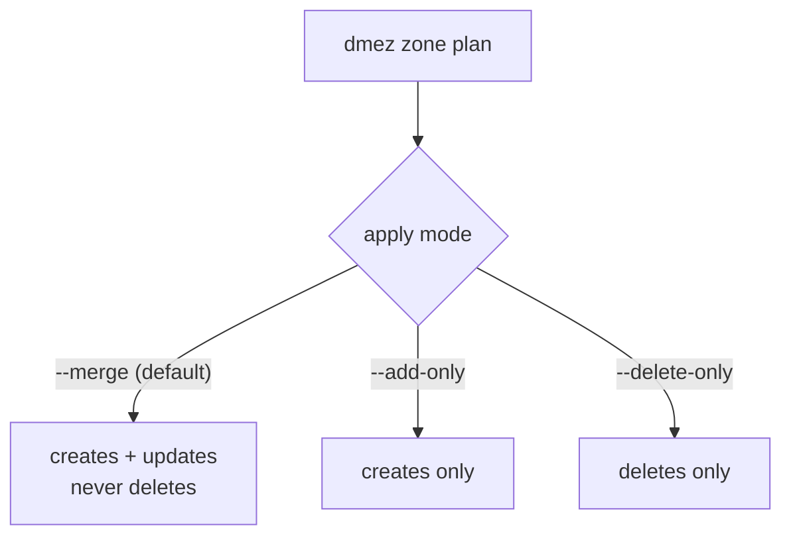

Earlier today I pushed version 1.0.1 of my Ruby gem [dnsmadeeasy](https://rubygems.org/gems/dnsmadeeasy) to RubyGems. The gem is seven years old. The previous release was in April of 2020. Some people age whiskey; apparently I age gems.

The new version can export an entire DNS zone into a standard RFC zone file, diff that file against production, and apply the difference back. Change, plan, apply. Terraform, minus the HCL, minus the state file, minus the existential dread.

Later in this post I run the whole loop live against `kig.re`, the domain serving the very page you are reading, including a record I create and then delete in front of you. But first, some history. It's my blog and I get to tell it.

## A Bit of a Back Story

I started my software career in Melbourne, Australia in the mid-nineties. What fascinated me immediately was that all two dozen Australian websites of the era carried extensions like `.com.au`, `.org.au`, `.net.au`, and of course `.edu.au`, specifically [my university](https://monash.edu), where I graduated with a Mathematics degree only to promptly abandon pure mathematics in favor of the oh so much more exciting computer engineering. Anyway. It bothered me deeply that while Australian sites had to live with that `.com.au` tax, sites in the US did not! They just ended with `.com`, as if America was the center of the Earth and that's where all the cables lead. And as a matter of fact, they did! DARPA (the US defense research agency) is credited with the "invention" of the Internet (sorry, Al Gore). So I guess it made sense that the US got the privilege of not appending `.us` to their own sites. Still, I must admit to a bit of begrudgery: a simmering resentment mixed with envy, directed at America's (however earned) superiority.

I had a 14.4Kb/s modem, which was the _shit_ at the time. I was already 21 and living separately from my parents, so I got a second telephone line, so I wouldn't have to compete with my wife's phone calls. The stage was set for me to be permanently connected to the completely new and uncharted world of the World Wide Web: news groups, ftp sites, gopher servers (gosh, that was one ugly thing). Having the second line meant that I (or more precisely, my PC) could be online 24/7 and (gasp) run a freaking _server_ that was, like, constantly available and shit. Over a 14.4Kb/sec line. So forget huge images. You just hoped your pure-text page loaded before your coffee went cold.

> [!NOTE]
>
> A few years later this "envy" would manifest itself in me leaving Melbourne and moving to San Francisco, to see if I could "make it" in the self-declared utterly superior center of the Internet world. The place was filled with folks warmly welcoming people from other countries who showed up with a crazy story, an accent, and some wild ideas in their head. I did exactly that in 1998, and for the time being I've been stuck here ever since.

We had a PC at the house (my parents bought me one) with a 200Mb hard drive. Which was huge at the time.

For some reason, DSL Internet back then paired your MAC address with the IP address they issued your modem, so my IP never changed in the three years I ran this server. It was all incredibly exciting, **and it was then that I decided I needed to run my own website.**

And that, of course, required a few things:

1. A non-Windows OS (i.e., a pre-1.0 Linux server)
2. The Apache Web Server
3. An idea for the website!
4. A fitting domain name, registered properly through the `*.com.au` registrar.
5. A couple of HTML pages, hand-coded, that returned something readable and useful.

### The Year Was: End of 1995, Start of 1996

#### So, let's travel back just a bit more than 30 years (or roughly 11K days)

I had just graduated with Honours from [Monash University](https://monash.edu) in Melbourne, which today proudly presents itself as [monash.edu](https://monash.edu), but back then was the unnecessarily elongated `www.monash.edu.au`. None of it mattered, because the Internet was so exciting and new. I dove head first into the weeds of programming, networking, DNS, HTTP, and before too long, my close friend Vitaly and I launched one of the first official public websites of its kind, something you'd today call a "craigslist for the local Russian-speaking community." Although even that would be a huge stretch.

> [!IMPORTANT]
>
> We take so much for granted today, but in the early days of the Internet you coded websites in pure HTML, page by page, and ran them on the Apache server, which was sort of the pinnacle of human invention at the time, and one of the first big projects that was open source and free to use and change.
>
> I remember thinking to myself how nice it would be if we didn't have to retype the HTML page headers on every single page. Right around that time Apache shipped server-side includes, and CGI came out, allowing truly dynamic sites to start popping up. I re-coded the entire site to use the new SSI feature in one evening, making the whole thing far more DRY than it was before.
>
> As for CGI, I did use it at work, on a portal for insurance brokers. But our site didn't need much dynamic structure: it was literally the yellow pages for Russian businesses in Melbourne. More specifically, one part of Melbourne where Russian speakers lived: St Kilda, around Balaklava Rd.

You see, I was born in Kharkiv, Ukraine, the largest city closest to the border, and immigrated to Australia from there. (I am not going to go there, but let's just say the last four years haven't been easy, by any means.)

So I paired up with my partner in crime Vitaly, and together we devised a plan to launch one of the first sites of that kind anywhere: a directory of Russian-speaking shops and services in Melbourne that wanted to be in our "database" (which at the time was an Excel spreadsheet, if not a text file).

The community we arrived into was packed densely around St Kilda and Balaklava Rd: folks who came in the 80s and early 90s, mixed with another contingent that stood out, the [Hasidic Jews](https://en.wikipedia.org/wiki/Hasidic_Judaism).

> [!NOTE]
>
> A slight tangent: I don't believe you could run any HTTP server software for free on Microsoft Windows, so the only option was Linux, which was at that point pre-1.0 and installable via some 40+ floppy disks, each holding 1.4Mb. Let's just say that getting Linux to boot on your PC, after inserting and swapping forty disks in exactly the right order, felt like pure magic. Around then I purchased a book, still one of my favorite technical books to date: ["The Underground Guide to UNIX"](https://www.amazon.com/Underground-Guide-UNIX-TM-Slightly/dp/0201406535). This is the one technical book that had me literally LOLing before LOL was a thing. Funny as hell. And probably quite applicable still.

## All About the DNS

### How DNS Works

Quick refresher, because the rest of this post depends on it.

When someone types `kig.re` into a browser, their machine asks a resolving name server. The resolver asks a root server: who runs `.re`? The root points at the `.re` TLD servers. The TLD servers point at whoever is *authoritative* for `kig.re`. Only that last box actually knows my records. Everything before it is just directions.


Here's the part people mix up constantly: the company where you *buy* a domain and the company that *answers* for it don't have to be the same company. I register domains at [Namecheap](https://www.namecheap.com) or [Gandi](https://www.gandi.net), whoever prices that TLD better this year. Then the first thing I do, before the confirmation email even lands, is go into their panel and point the NS records at DNS Made Easy. The registrar keeps the paperwork. DME answers the questions.

```bash
$ dig +short NS kig.re
ns0.dnsmadeeasy.com.
ns1.dnsmadeeasy.com.
ns2.dnsmadeeasy.com.
ns3.dnsmadeeasy.com.
ns4.dnsmadeeasy.com.
```

The registrar's one real DNS job is telling the `.re` TLD which nameservers speak for me. That's the delegation. That's the whole trick.

### Moving Domains Between Providers

Moving a domain between DNS providers should be boring. Painfully boring.

It should rank somewhere between renewing your driver's license online and watching paint dry.

Instead, it's one of those engineering tasks where you confidently think, _"I'll knock this out before lunch,"_ and suddenly it's dark outside, you're surrounded by browser tabs, and you've learned more about one provider's CSV dialect than any human being should.

## Wait... doesn't DNS already have a standard?

Every DNS provider proudly advertises:

> "Export your DNS records!"

Fantastic.

Surely the next provider lets me import that same file?

No.

Instead, they would like a CSV.

Not **the** CSV.

**Their** CSV.

Every provider appears to have held the same product meeting sometime around 2006.

> "We should support imports."
> "Great idea."
> "Should we use the existing standard?"
> "....absolutely not."

---

The truly funny part is that DNS **already has a standard interchange format**.

_**Zone files.**_

They've existed forever.

They're compact.

They're human-readable.

They're battle-tested.

Most providers can export one.

Very few can import one.

Which is a little like every bank allowing you to withdraw money but insisting deposits arrive by carrier pigeon.

## The Copy/Paste Olympics

The alternative is familiar to anyone who's managed more than one domain.

- Open provider A
- Open provider B
- Copy one record.
- Paste.
- Rinse,
- Repeat.

Forty-three times.

Miss one TXT record.

Spend thirty minutes wondering why email stopped working.
Eventually discover the missing quotation mark.
Question your career choices.

---

I don't particularly enjoy repetitive work. I enjoy eliminating repetitive work. Those are very different hobbies.

## Fine. I'll Write the Thing

So back in the day it started as a tiny script. I used one particular provider that was reliable and fast: [DNSMadeEasy.com](https://dnsmadeeasy.com), which recently merged with [DigiCert](https://www.digicert.com/).

A word on why them, because it explains how I pick vendors in general. My mantra: pick the underdog. Underdogs are still innovating, still hungry, and they may surprise you. Over the years this rule got me NewRelic, Datadog, Fastly, and Joyent, all before they were the obvious choice. DNSMadeEasy is that pick for DNS: a boutique shop that has been doing one thing well since 2002.

And "well" here is measurable. While writing this post I timed their authoritative answers for `kig.re` from my desk: 6 to 11 milliseconds. Their homepage claims [22+ years of 100% uptime](https://www.dnsmadeeasy.com/), the longest in the industry. The lawyers who wrote DigiCert's [acquisition press release](https://www.prnewswire.com/news-releases/digicert-acquires-dns-made-easy-extending-its-leadership-in-digital-trust-with-enterprise-grade-managed-dns-services-301564617.html) preferred the more careful "five nines for more than a decade." Somewhere between those two numbers lives the truth, and either one beats every incident retro I've ever sat in. My own monitoring has never once blamed them.

In my Wanelo days we used them as well, and I took over a decently written and well tested API gem that exposed every operation of their API as a Ruby method, plus a CLI we added later.

But yesterday I had a different annoyance.

### Enter Email Configuration

For each email provider, to configure a domain you must these days add a slew of records: MX records, SPF as TXT, DKIM CNAMEs for signing, more CNAMEs for click tracking, and so on. [Resend](https://resend.com), [SendGrid](https://sendgrid.com), Proton, doesn't matter: each one hands you a page of records and wishes you luck. After doing this once, for one domain, and realizing I needed to do it five more times, I decided we live in an era when big dreams can be handled by AI in a few hours. By the smart AI. In my case, Claude.

Unfortunately, Claude decided to take a beating yesterday morning and was returning errors regardless of which model I chose.

So, with some curiosity, I decided to try `codex`. I described the gem refactor: that I wanted to move to the `dry-cli` model, which I not so succinctly described in [one of my older posts](https://kig.re/2020/09/07/writing-cli-tools-ruby-migrating-github-issues-to-pivotal-tracker.html), and most importantly, that I wanted bulk operations that made sense. I wanted to export a domain's zone file, drop records into it, and have the thing merge it smartly with what's already live.

As the strategy I chose the Terraform model: you change → you plan → you apply.

We split the work into nine distinct parts, and `codex` went to work. Sort of.

### Complaining about Codex

What can I say. I felt transported back nine months. Codex constantly kept asking for permission, and no matter what I tried, it kept asking to run a command every thirty seconds. A major annoyance.

In several hours it finally produced nine stacked PRs, which I merged and started testing. And what do you know. That shit had bugs up the wazoo.

Let's start with the double double-quoting of the TXT records. These come out of the provider already double-quoted, and yet Codex thought it necessary to wrap them in single quotes around the double quotes.

> Not necessary. In fact, harmful.

I had to take care of my daughter, so I checked everything in, called it version 1.0, and left.

Upon my return I was glad to find Claude resuscitated and functional again. Not wanting to waste any more time, I grabbed "fable" on "max effort" and started digging into the codebase.

### Summary of CLI Changes

The gem previously offered the `dme` executable followed by one singular operation the provider supported, such as `update_record`. I wanted to move those under a sub-command, `dme account <operation>`, and add a brand new command that operated on entire DNS zones: `zone export`, `zone plan`, `zone apply`, and so on. The zone workflow ships as its own binary, `dmez`.

Let's just say that when Claude started looking at the codebase, it found countless bugs, and I was relieved I never pushed that 1.0.0 state to rubygems.org.

### Implementation

The `zone` command required:

- a proper parser
- a proper serializer
- a proper diff-producing logic
- validation
- import/export support
- tests

Congratulations.

The quickly put together gem had become a real piece of software.

## ANAME

After fixing all the double double-quoting, we ran into a more interesting problem. DNSMadeEasy supports a very useful extension to standard DNS: the `ANAME` record.

Here's the deal. You cannot put a CNAME at the apex of a zone. The RFC forbids it: the apex already holds your SOA and NS records, and a CNAME tolerates no neighbors. But everybody wants their bare domain pointing at a CDN hostname. So providers invented the ANAME (elsewhere called ALIAS): it looks like a CNAME in your zone, but the provider resolves it at the edge and serves plain A records to the world. The target moves, your apex follows. No RFC police involved.

My own apex is exactly this. `kig.re` is an ANAME to `t.sni.global.fastly.net`, and in the export below you can see both the ANAME and the four A records it currently resolves to, side by side.

Since `ANAME` doesn't exist in any RFC, it also doesn't exist in the standard zone-file grammar, so the parser treats it as a first-class extension. Exports keep `ANAME` as `ANAME` by default, because that round-trips cleanly through plan and apply. And when you need a strictly RFC-compliant file, for migrating away or feeding some ancient validator, there's `--strict-rfc`: ANAMEs get flattened into whatever A records they resolve to at that moment, which is exactly what DME's own export button does. The gem prints a warning for each flattened record, because a snapshot is a snapshot. If Fastly renumbers next week, flattened records won't follow.

## Talk Is Cheap. Here Is My Actual Zone.

Enough theory. Let's run the entire loop, live, on this blog's own domain. And yes, I am about to print my real DNS records in a blog post. Relax. DNS is the most public database on Earth; anyone with `dig` can read all of this. The only secret in DNS is knowing which questions to ask.

The loop we're about to run:


### Step 1: Export

```bash
$ dmez zone export kig.re --output=kig.re.zone

╔ ✔ OK ═══════════════════════════╗
║ Zone export complete.           ║
║ Domain: kig.re                  ║
║ Records: 22                     ║
║ Destination: kig.re.zone        ║
╚═════════════════════════════════╝
```

(Transcripts here are trimmed to fit your screen; the real boxes are wider and even prettier. Note that the status box goes to stderr. Stdout carries nothing but payload, so you can pipe `dmez` into anything without your zone file growing decorative Unicode borders.)

And here is the file it wrote. My entire zone, as one readable, standard, version-controllable document:

```dns
$ORIGIN kig.re.
$TTL 60

@        300 IN A       151.101.131.52
@        300 IN A       151.101.195.52
@        300 IN A       151.101.3.52
@        300 IN A       151.101.67.52
@        300 IN ANAME   t.sni.global.fastly.net.
*        300 IN CNAME   t.sni.global.fastly.net.
_acme-challenge IN CNAME   y9ywy6qvq6tlsrvu57.fastly-validations.com.
dev      IN A       127.0.0.1
fastly-backend 300 IN A       100.21.133.254
protonmail._domainkey IN CNAME   protonmail.domainkey.dqe46vx2hu7jpzzytxgarfkvusknlrojslxbqtq3b3dxraboadwaq.domains.proton.ch.
protonmail2._domainkey IN CNAME   protonmail2.domainkey.dqe46vx2hu7jpzzytxgarfkvusknlrojslxbqtq3b3dxraboadwaq.domains.proton.ch.
protonmail3._domainkey IN CNAME   protonmail3.domainkey.dqe46vx2hu7jpzzytxgarfkvusknlrojslxbqtq3b3dxraboadwaq.domains.proton.ch.
ssh      IN A       100.21.133.254

@        IN MX      10 mail.protonmail.ch.
@        IN MX      20 mailsec.protonmail.ch.

_imaps._tcp 1800 IN SRV     0 1 993 imap.fastmail.com.
_pop3s._tcp 1800 IN SRV     10 1 995 pop.fastmail.com.
_submission._tcp 1800 IN SRV     0 1 587 smtp.fastmail.com.

@        IN TXT     "google-site-verification=0zuNS7LPGPFnVbjE4MbhQ1MaGU3SnCoaBIeBpoapQiE"
@        IN TXT     "protonmail-verification=299c3ae5dbe58d471065cf7698cb65b1844e64db"
@        IN TXT     "v=spf1 include:_spf.protonmail.ch ~all"
_dmarc   IN TXT     "v=DMARC1; p=quarantine"
```

A few things worth noticing in there:

- The apex holds both the `ANAME` and the four A records it currently flattens to. That's the Fastly story from the previous section, caught in the wild.
- `dev` points at `127.0.0.1`. Localhost is my dev environment and I stand by it.
- Yes, there is an `ssh` record. Mind your business.
- Three geological layers of email: Proton DKIM records (current), Fastmail SRV records (an era I left years ago), and a DMARC policy on top. Your DNS zone is an archaeological dig of your own past decisions. It never forgets, unless you make it.

### Step 2: Plan, with nothing changed

First, a confession I'm choosing to make in public. `plan` is supposed to infer the domain from `$ORIGIN`, and in 1.0.1 it grabs the origin with its trailing dot, sends `kig.re.` to the API, and gets a 404 for its trouble. I found this while writing this very post. Pass `--domain` explicitly for now. This is what 1.0.2 releases are for.

```bash
$ dmez zone plan kig.re.zone --domain=kig.re

╔ ✔ OK ═══════════════════════════╗
║ Zone plan complete for kig.re.  ║
║ Creates: 0, Updates: 0          ║
║ Skipped creates: 0,             ║
║ Skipped deletes: 0              ║
╚═════════════════════════════════╝
No changes.
```

`No changes.` The exported file and production agree on reality. This one line would have saved me hours over the years: it means the file round-trips, and the gem and the provider are looking at the same world.

### Step 3: Add a record, plan, apply

Let's add a harmless TXT record to the bottom of the file:

```dns
dmez-demo 60 IN TXT     "dmez 1.0.1 was here (zone apply demo)"
```

Plan sees exactly one thing to do:

```bash
$ dmez zone plan kig.re.zone --domain=kig.re
Create
  - dmez-demo TXT dmez 1.0.1 was here (zone apply demo) (ttl=60)

$ dmez zone apply kig.re.zone --domain=kig.re --add-only --yes

╔ ✔ OK ═══════════════════════════╗
║ Zone apply complete for kig.re. ║
║ Applied: 1                      ║
║ Failed: 0                       ║
║ Skipped: 0                      ║
╚═════════════════════════════════╝
```

Two seconds later, the authoritative servers were already answering for it:

```bash
$ dig +short TXT dmez-demo.kig.re @ns0.dnsmadeeasy.com
"dmez 1.0.1 was here (zone apply demo)"
```

Two. Seconds.

Notice the `--add-only` flag. Apply has three blast-radius modes, and picking one forces exactly the right amount of thinking:



Adding email records to a live business domain with a mode that is structurally incapable of deleting your MX records is the closest DNS gets to a good night's sleep.

### Step 4: Now Delete It

Take the line back out of the file and plan again:

```bash
$ dmez zone plan kig.re.zone --domain=kig.re
Skipped Deletes
  - dmez-demo TXT dmez 1.0.1 was here (zone apply demo) (ttl=60) (Delete skipped by default)
```

Look at that. The record is missing from the file, present in production, and the default answer is: *I see it, and I will not delete it unless you say so.* I have been burned by tools with default-aggressive diffs. Not this one.

Say so:

```bash
$ dmez zone apply kig.re.zone --domain=kig.re --delete-only --yes

╔ ✔ OK ═══════════════════════════╗
║ Zone apply complete for kig.re. ║
║ Applied: 1                      ║
║ Failed: 0                       ║
║ Skipped: 0                      ║
╚═════════════════════════════════╝

$ dmez zone plan kig.re.zone --domain=kig.re
No changes.
```

Full circle. Export, edit, plan, apply, and the zone is exactly what the file says it is.

One honest footnote: the create reached the edges in about two seconds, while the delete took a few minutes to fall off all five nameservers. Creates sprint, deletes stroll. The control plane was consistent immediately; the edges caught up on their own schedule.

And the email annoyance that started all of this? It's now: paste the provider's block of MX, SPF, and DKIM records into the zone file, `plan`, `apply --add-only`, done. Five domains, ten minutes, zero browser tabs. One fell swoop.

## DNSMadeEasy Today, Everyone Tomorrow

The gem can read standard DNS zone files and convert them into a provider-independent model.

Today that means DNS Made Easy.

Tomorrow it could just as easily be Route53, Cloudflare, Porkbun, Namecheap, Gandi, or whichever provider catches my attention next.

The architecture was intentionally built around adapters because I'd much rather write _one_ parser than thirty-seven importers.

## Ruby Makes This Stuff Fun

This is one of those projects that reminds me why I still enjoy writing Ruby after all these years.

Parsing text.

Building tiny DSLs.

Expressive object models.

Writing tests that read like English.

Ruby remains unusually pleasant for this kind of software.

## The Bigger Dream

I'd love to see a future where moving DNS providers looks like this:

```bash
dmez zone export example.com --output=example.com.zone
# edit the file
dmez zone plan example.com.zone --domain=example.com
# see the diff
dmez zone apply example.com.zone --domain=example.com --yes
# watch the diff get applied to the provider via their API
```

No spreadsheets.

No copy and paste.

No mystery CSV formats.

No browser tabs multiplying like rabbits.

Just DNS records.

Exactly as the Internet intended.

## Try It

```bash
gem install dnsmadeeasy
dmez zone export yourdomain.com --output=yourdomain.com.zone
```

The code is on [GitHub](https://github.com/kigster/dnsmadeeasy), with plenty more CLI examples in the README. The gem lives on [RubyGems](https://rubygems.org/gems/dnsmadeeasy). Stars are appreciated, issues are welcome, and if you feel like building an adapter for another provider, PRs are extra welcome.

⸻

If you've ever lost an afternoon migrating DNS records, or discovered at 2 A.M. that one forgotten TXT record quietly broke email, I hope this saves you a little frustration.

Sometimes the best open-source projects don't begin with grand ambition.

Sometimes they begin with muttering:

"This is ridiculous. There has to be a better way."
